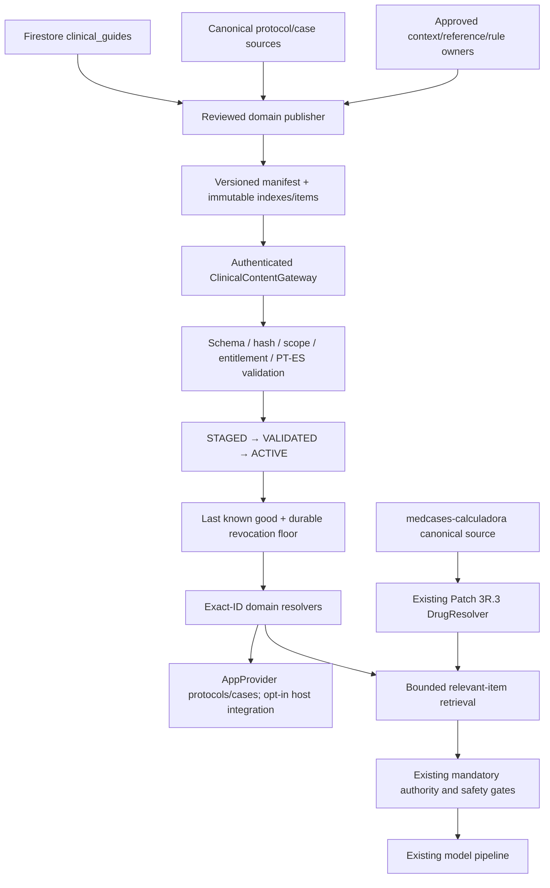

# Remote Clinical Platform Foundation V1

Authority remains with each domain's authoring source, never with a cache or projection. `ClinicalContentPlatform.drugs` reuses the existing canonical calculator resolver behind a DrugResolver bridge. When a validated drugs snapshot is present, exact lookups/indexes use its last-known-good data and honor tombstones; network cannot resurrect a revoked ID. It does not rewrite the 838-item typed-evidence bundle or embed a drug database.

The host configures one gateway with an approved HTTPS base URI, token provider, current session scope (account + entitlement epoch), local entitlement callback and account-scoped durable store. `AppProvider.configureRemoteClinicalContent` attaches that gateway; `synchronizeRemoteClinicalContent` activates a valid release and notifies UI listeners. The protocol/case getters consume a validated domain snapshot, otherwise retain their shipped databases. After a domain becomes active, a revoked or inaccessible entry is not resurrected through those legacy getters.

Guides retain their existing Firestore service as fallback. Once a validated guides domain is active, loadPublished, watchPublished and loadById consume the snapshot, including revocation. The 18 published guides were read into an audit-only preparation artifact. Three fail structural PT/ES validation; no guide content was translated, corrected, removed or republished. The bridge is implemented, but no cutover to an unapproved endpoint is performed.

Contexts, simulations, references, interactions, drug evidence, clinical rules and review metadata have registered domain contracts. This is not a claim that every such domain already has a reviewed publication feed. Prepared/shadow registries and experimental simulations are not promoted. A standalone active simulation registry was not established; shipped educational cases remain intact.

No endpoint has been deployed/configured in production by this macrobuild. The HTTP publisher artifact layout is ready for review and hosting behind the selected auth gateway. Credentials, publication approval, source migrations and a real-session rollout remain deployment gates. The existing Study/Plantão prompt pipelines and authorities remain unchanged; relevant retrieval APIs do not automatically inject remote payloads into an LLM prompt.
